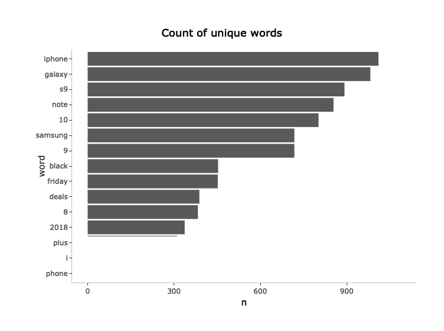
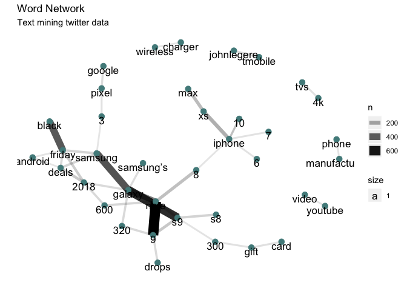

Text Mining Twitter Data in R
================
Santiago Toso

Searching for Tweets
====================

First thing we are going to import the libraries needed.

Here is a brief explaination of each library:

`rtweet` is the library that will allow us to get data from Twitter and treat it.

`ggplot2` is, maybe, the most famous ploting library for R and we'll use it to make nice looking graphs.

`dplyr` is a library that will allow us do things quicker and better when treating data frames.

`tiditext` as its description tells us *implemets tidy data principles to make many text mining tasks easier, more effective, and consistent with tools already in wide use*.

`igraph` and `ggraph` are ploting libraries.

`plotly` is a library that allow us to make interactive plots.

`qdapRegex` will help us to work with URLs in Tweets.

Now let's get some tweets about the iPhone and Samsung.

``` r
terms_apple <- c('iphone', 'iPhone', 'iphonex', 'iPhoneX','#iphone', '#iPhone', '#iphonex', '#iPhoneX', 'iphone10', 'iPhone10', 'iphone 10', 'iPhone 10', '#iphone10', '#iPhone10')
terms_samsung <- c('Samsung', 'samsung', 'Samsung S9', 'samsung s9','#Samsung', '#samsung', '#Samsung S9', '#samsung s9', 'samsung galaxy s9', 'Samsung Galaxy S9', '#samsunggalaxys9', 'samsung galaxy note s9', 'Samsung Galaxy Note S9', '#samsunggalaxynotes9')

terms_apple <- paste(terms_apple, collapse = ' OR ')
terms_samsung <- paste(terms_samsung, collapse = ' OR ')

phone_tweets <- search_tweets2(q = c(terms_apple, terms_samsung), 
                               n = 1000, 
                               lang = 'en',
                               include_rts = FALSE
                               )
```

    ## Searching for tweets...

    ## Finished collecting tweets!

    ## Searching for tweets...

    ## Finished collecting tweets!

``` r
head(phone_tweets$text)
```

    ## [1] "App Store US Top Paid iPhone Apps: #10 Kingdom Rush Vengeance #Games https://t.co/ICPRcjcyXG https://t.co/nsPvG8c7kB"         
    ## [2] "App Store UK Top Paid iPhone Apps: #10 TBR for Tumblr #SocialNetworking https://t.co/6fPSFAUVOz https://t.co/koI547RJZ5"      
    ## [3] "App Store US Top Paid iPhone Apps: #10 TBR for Tumblr #SocialNetworking https://t.co/6fPSFAUVOz https://t.co/DnGKGhdH4O"      
    ## [4] "App Store AU Top Free iPhone Apps: #10 Gmail - Email by Google #Productivity https://t.co/NaXrvRz1VP https://t.co/m6fv8DSSOH" 
    ## [5] "App Store UK Top Free iPhone Apps: #10 Facebook #SocialNetworking https://t.co/pgHJKO9ekM https://t.co/oOryvngXlQ"            
    ## [6] "App Store AU Top Paid iPhone Apps: #10 Monash University FODMAP diet #Medical https://t.co/pBXdRYuccu https://t.co/kkEuWxs8Sf"

Data Clean-Up
=============

Looking at the data we have it seems clear that there is a lot to clean up first.

Removing URL
------------

The first thing we see is that there are a lot of URLs in the tweets and they won't help us analyze the text. We can get rid of them.

``` r
phone_tweets <- phone_tweets %>% 
  mutate(stripped_text = rm_url(phone_tweets$text))

head(phone_tweets$stripped_text)
```

    ## [1] "App Store US Top Paid iPhone Apps: #10 Kingdom Rush Vengeance #Games"         
    ## [2] "App Store UK Top Paid iPhone Apps: #10 TBR for Tumblr #SocialNetworking"      
    ## [3] "App Store US Top Paid iPhone Apps: #10 TBR for Tumblr #SocialNetworking"      
    ## [4] "App Store AU Top Free iPhone Apps: #10 Gmail - Email by Google #Productivity" 
    ## [5] "App Store UK Top Free iPhone Apps: #10 Facebook #SocialNetworking"            
    ## [6] "App Store AU Top Paid iPhone Apps: #10 Monash University FODMAP diet #Medical"

Now we need to tokenize the texts. This means we have to separate each word of the sentece. What we'll do is:

1.  **Convert text to lowercase:** each word found in the text will be converted to lowercase so ensure that you don’t get duplicate words due to variation in capitalization.
2.  **Punctuation is removed:** all instances of periods, commas etc will be removed from your list of words , and
3.  **Unique id associated with the tweet:** will be added for each occurrence of the word

``` r
words <- phone_tweets %>%
  select(stripped_text) %>%
  unnest_tokens(word, stripped_text)

head(words)
```

    ## # A tibble: 6 x 1
    ##   word  
    ##   <chr> 
    ## 1 app   
    ## 2 store 
    ## 3 us    
    ## 4 top   
    ## 5 paid  
    ## 6 iphone

``` r
words %>% 
  count(word, sort = TRUE) %>%
  top_n(15) %>%
  mutate(word = reorder(word, n))
```

    ## Selecting by n

    ## # A tibble: 15 x 2
    ##    word        n
    ##    <fct>   <int>
    ##  1 iphone   1087
    ##  2 galaxy    982
    ##  3 s9        892
    ##  4 the       863
    ##  5 note      854
    ##  6 10        802
    ##  7 for       760
    ##  8 and       753
    ##  9 9         718
    ## 10 samsung   718
    ## 11 to        675
    ## 12 a         537
    ## 13 black     453
    ## 14 friday    452
    ## 15 on        412

Now what we see is that words like **for** and **the** are in there. These kind of words are called **stopwords** and we'll remove them to improve our analysis.

To do so, we can download a library where the stopwords for different languages are.

Removing Stopwords
------------------

``` r
library(stopwords)
head(stop_words)
```

    ## # A tibble: 6 x 2
    ##   word      lexicon
    ##   <chr>     <chr>  
    ## 1 a         SMART  
    ## 2 a's       SMART  
    ## 3 able      SMART  
    ## 4 about     SMART  
    ## 5 above     SMART  
    ## 6 according SMART

``` r
words <- phone_tweets %>%
  select(stripped_text) %>%
  unnest_tokens(word, 
                stripped_text,
                stopwords = stopwords("en"))
```

Let's take a look now.

``` r
 g <- words %>% 
  count(word, sort = TRUE) %>%
  top_n(15) %>%
  mutate(word = reorder(word, n)) %>% 
  ggplot(aes(x = word, y = n)) +
  geom_col() +
  coord_flip() +
  labs(title = 'Count of unique words') +
  scale_fill_brewer(palette="Dark2") +
  theme(panel.grid.major = element_blank(),
        panel.grid.minor = element_blank(),
        panel.background = element_blank(),
        axis.line.x = element_line(colour = "grey"),
        axis.line.y = element_line(colour = "grey"),
        plot.title = element_text(hjust = 0.5)
        )
```

    ## Selecting by n

``` r
ggplotly(g)
```



Networks of words
=================

We could analyze n-grams. An n-gram is a group of words that are usually together. In this case, will analyze pair of words. To do so, we can use the `unnest_tokens` function introduced previously changing some parameters.

``` r
library(tidyr)
```

    ## 
    ## Attaching package: 'tidyr'

    ## The following object is masked from 'package:igraph':
    ## 
    ##     crossing

``` r
n_grams <- phone_tweets %>% 
  select(stripped_text) %>% 
  unnest_tokens(ngrams, 
                stripped_text, 
                token = 'ngrams', 
                n = 2) %>% 
  separate(ngrams, c('word1', 'word2'), sep = ' ') %>% 
  filter(!word1 %in% stop_words$word) %>% 
  filter(!word2 %in% stop_words$word) %>% 
  count(word1, word2, sort = TRUE)

head(n_grams)
```

    ## # A tibble: 6 x 3
    ##   word1   word2      n
    ##   <chr>   <chr>  <int>
    ## 1 note    9        663
    ## 2 galaxy  s9       545
    ## 3 samsung galaxy   437
    ## 4 black   friday   424
    ## 5 galaxy  note     329
    ## 6 iphone  xs       187

Now we can plot the network.

``` r
n_grams %>% 
  filter(n >= 40) %>% 
  graph_from_data_frame() %>% 
  ggraph() +
  geom_edge_link(aes(edge_alpha = n, edge_width = n)) +
  geom_node_point(color = 'darkslategray4', size = 3) +
  geom_node_text(aes(label = name, vjust = 1, size= 1)) + 
  labs(title = "Word Network",
             subtitle = "Text mining twitter data ",
             x = "", y = "") +
  scale_fill_brewer(palette="Dark2") +
  theme(panel.background = element_blank(),
        panel.grid = element_blank(),
        axis.line = element_blank(),
        axis.ticks = element_blank(),
        axis.text = element_blank()
        )
```

    ## Using `nicely` as default layout


