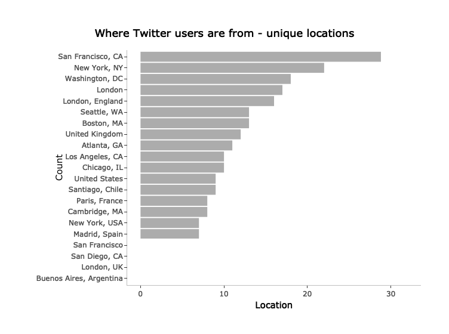

Getting data from Twitter
================
Santiago Toso
9/25/2018

When reaseaching how to get data from twitter using R, I found two main libraries `rtweet` and `twitteR`. Even if both worked fine during my short tests, I decided to go with `rtweet` since it is developped by the Rcran project.

Installing libraries
====================

First of all, we'll intall the libraries needed to get the data and analyze it.

``` r
library(rtweet)
library(ggplot2)
library(dplyr)
```

    ## 
    ## Attaching package: 'dplyr'

    ## The following objects are masked from 'package:stats':
    ## 
    ##     filter, lag

    ## The following objects are masked from 'package:base':
    ## 
    ##     intersect, setdiff, setequal, union

``` r
library(tidytext)
library(plotly)
```

    ## 
    ## Attaching package: 'plotly'

    ## The following object is masked from 'package:ggplot2':
    ## 
    ##     last_plot

    ## The following object is masked from 'package:stats':
    ## 
    ##     filter

    ## The following object is masked from 'package:graphics':
    ## 
    ##     layout

If you get an error saying that the libraries don't exist you should install the packages first and then the libraries:

``` r
# install.packages("rtweet")
# install.packages("ggplot2")
# install.packages("dplyr")
# install.packages('tidytext')
# install.packages('plotly')

library(rtweet)
library(ggplot2)
library(dplyr)
library(tidytext)
library(plotly)
```

Here is a brief explaination of each library:

`rtweet` is the library that will allow us to get data from Twitter and treat it.

`ggplot2` is, maybe, the most famous ploting library for R and we'll use it to make nice looking graphs.

`dplyr` is a library that will allow us do things quicker and better when treating data frames.

`tiditext` as its description tells us *implemets tidy data principles to make many text mining tasks easier, more effective, and consistent with tools already in wide use*.

Authentication to Twitter
=========================

The first thing we need to do is to set up our authentication to Twitter. To do so we need to provide:

1.  Appname
2.  Consumer Key
3.  Consumer Secret
4.  Access Token
5.  Access Secret

Those values are in your apps details. **Give more information about where to find those**. You should do it in the following way:

``` r
#Change these for generic values before publishing

appname <- "FollowWorldCup"
consumer_key <- "86A0tQescm2Fr2ANCeDNIAvyz"
consumer_secret <- "A0Q7qNd9Xwf0HMtSWYdF37L5gPKtj4TpOszR3q1cbI91y9HngK"
access_token <- "175062468-QqD9NQRTF2sGh8OwuaQC1eqAJUWrkA5N6ZjMXv0s"
access_secret <- "y3gNdK4eIm6fxpcgzzaXElregF0Kq4SItRY78zWyalfMk"
```

Now that we have all the needed values we can create a Twitter token and start twitting and getting tweets. To create the token you'll have to use the following function:

``` r
twitter_token <- create_token(
  app = appname,
  consumer_key = consumer_key,
  consumer_secret = consumer_secret,
  access_token = access_token,
  access_secret = access_secret)
```

Now that we have the Token created we can start looking for tweets or even send one!

Sending a tweet
===============

To send a tweet from R we simply have to use the `post_tweet` function and keep in mind it has to be 280 characters or less!

``` r
post_tweet("This is my first tweet using the #rtweet library. Really excited to start doing some #datascience!")
```

    ## $errors
    ## $errors[[1]]
    ## $errors[[1]]$code
    ## [1] 187
    ## 
    ## $errors[[1]]$message
    ## [1] "Status is a duplicate."

Now a tweet has been sent from our account!

Search tweets in Twitter
========================

Now we can search for tweets. We will start introducing the function `search_tweets` and we will get deeper as we go. To use this function we have to specify at least two arguments:

1.  **q: ** the term we want to look up.

2.  **n: ** the number of tweets we want to get.

In this case we'll start looking for *data science* and analyze the different cases.

``` r
ds <- search_tweets(q = 'data science', n = 10)
```

    ## Searching for tweets...

    ## Warning: Rate limit exceeded - 88

    ## Warning: Rate limit exceeded

    ## Finished collecting tweets!

``` r
ds_1 <- search_tweets(q = 'data OR science', n = 10)
```

    ## Searching for tweets...

    ## Warning: Rate limit exceeded - 88

    ## Warning: Rate limit exceeded

    ## Finished collecting tweets!

``` r
ds_2 <- search_tweets(q = '"data science"', n = 10)
```

    ## Searching for tweets...

    ## Warning: Rate limit exceeded - 88

    ## Warning: Rate limit exceeded

    ## Finished collecting tweets!

So, what you might be asking yourself what is the difference between these three ways of searching for *data science*. Well, here goes the explaination:

1.  **'data science'** looks for every tweet that contains *data* AND *science* in any order and position in the text. The only condition is that both words have to appear in the tweet.

2.  **'data OR science'** looks for every tweet that contains either *data* OR *science*, but never both.

3.  **'"data science"'** looks for the exact phrase in that exact order. In this case the tweet has to contain exactly *data science* to fall into this bag. This is the one we are going to use in the following cases.

``` r
ds <- search_tweets(q = '"data science"', n = 1000)
```

    ## Searching for tweets...

    ## Warning: Rate limit exceeded - 88

    ## Warning: Rate limit exceeded

    ## Finished collecting tweets!

``` r
head(ds)
```

    ## data frame with 0 columns and 0 rows

Now we have 1000 tweets with *data science* in them.

Using more than one query
-------------------------

We could use the `Map` function to make multiple independent search queries. The `Map` function takes two arguments:

1.  A function to apply
2.  The arguments we want to use for the function in 1. These arguments could be vectors.

So, to apply the `search_tweets` function different queries we could do something like this:

``` r
ds_map <- Map(
  "search_tweets",
  c('"data science"', "r OR python"),
  n = 1000
)
```

    ## Searching for tweets...

    ## Warning: Rate limit exceeded - 88

    ## Warning: Rate limit exceeded

    ## Finished collecting tweets!
    ## Searching for tweets...

    ## Warning: Rate limit exceeded - 88

    ## Warning: Rate limit exceeded

    ## Finished collecting tweets!

``` r
summary(ds_map)
```

    ##                Length Class      Mode
    ## "data science" 0      data.frame list
    ## r OR python    0      data.frame list

What we are doing now is getting 1000 tweets that have *data science* in them and a 1000 more tweets that talk about *r* or *python* in two different data frames.

If we wanted to bring them together in the same dataframe we could do this:

``` r
ds_map <- do_call_rbind(ds_map)
```

Another way of accomplishing this task would be using the function `search_tweets2` function like this:

``` r
st2 <- search_tweets2(
  c('"data science"', "r OR python"),
  n = 1000
)
```

    ## Searching for tweets...

    ## Warning: Rate limit exceeded - 88

    ## Warning: Rate limit exceeded

    ## Finished collecting tweets!
    ## Searching for tweets...

    ## Warning: Rate limit exceeded - 88

    ## Warning: Rate limit exceeded

    ## Finished collecting tweets!

``` r
table(st2$query)
```

    ## < table of extent 0 >

Excluding retweets
------------------

Many times we will find the same tweet retweeted by other users. If we want to avoid retweets we have to specify it in the `search_tweets` function.

``` r
st2 <- search_tweets2(
  c('"data science"', "r OR python"),
  n = 2000,
  include_rts = FALSE
)
```

    ## Searching for tweets...

    ## Warning: Rate limit exceeded - 88

    ## Warning: Rate limit exceeded

    ## Finished collecting tweets!
    ## Searching for tweets...

    ## Warning: Rate limit exceeded - 88

    ## Warning: Rate limit exceeded

    ## Finished collecting tweets!

``` r
table(st2$query)
```

    ## < table of extent 0 >

What's inside a tweet?
======================

We have now a lot of tweets, let's see what a tweet has inside. The first thing we can do is take a look at all the variables a tweet has.

``` r
names(st2)
```

    ## character(0)

We see that there is a lot of information in every tweet. Of course, some of the tweets have `NA` values in some variables but it is fair to say that we will be able to make various analysis on this.

We have the text of the tweet, the location, user, hashtags and many more fields to explore.

So, how does it look like?

``` r
head(st2, 1)
```

    ## data frame with 0 columns and 0 rows

Learning about the users
========================

Now that we have the tweets and now better what is inside them, we could find out who are the people tweeting about *data science, R or Python*.

``` r
length(unique(st2$screen_name))
```

    ## [1] 0

In the same way, if we just wanted to know who were the people talking about these subjects we could have use `search_users` to get the info just about the authors of the tweets.

``` r
users <- search_users("data science", n = 1000)
```

    ## Searching for users...

    ## Finished collecting users!

``` r
head(users, n = 2)
```

    ## # A tibble: 2 x 88
    ##   user_id status_id created_at          screen_name text  source
    ##   <chr>   <chr>     <dttm>              <chr>       <chr> <chr> 
    ## 1 733536… 10300989… 2018-08-16 14:28:25 dtscnc      How … Tweet…
    ## 2 141748… 10658930… 2018-11-23 09:01:16 analyticbr… How … Hoots…
    ## # ... with 82 more variables: display_text_width <dbl>,
    ## #   reply_to_status_id <chr>, reply_to_user_id <chr>,
    ## #   reply_to_screen_name <chr>, is_quote <lgl>, is_retweet <lgl>,
    ## #   favorite_count <int>, retweet_count <int>, hashtags <list>,
    ## #   symbols <list>, urls_url <list>, urls_t.co <list>,
    ## #   urls_expanded_url <list>, media_url <list>, media_t.co <list>,
    ## #   media_expanded_url <list>, media_type <list>, ext_media_url <list>,
    ## #   ext_media_t.co <list>, ext_media_expanded_url <list>,
    ## #   ext_media_type <chr>, mentions_user_id <list>,
    ## #   mentions_screen_name <list>, lang <chr>, quoted_status_id <chr>,
    ## #   quoted_text <chr>, quoted_created_at <dttm>, quoted_source <chr>,
    ## #   quoted_favorite_count <int>, quoted_retweet_count <int>,
    ## #   quoted_user_id <chr>, quoted_screen_name <chr>, quoted_name <chr>,
    ## #   quoted_followers_count <int>, quoted_friends_count <int>,
    ## #   quoted_statuses_count <int>, quoted_location <chr>,
    ## #   quoted_description <chr>, quoted_verified <lgl>,
    ## #   retweet_status_id <chr>, retweet_text <chr>,
    ## #   retweet_created_at <dttm>, retweet_source <chr>,
    ## #   retweet_favorite_count <int>, retweet_retweet_count <int>,
    ## #   retweet_user_id <chr>, retweet_screen_name <chr>, retweet_name <chr>,
    ## #   retweet_followers_count <int>, retweet_friends_count <int>,
    ## #   retweet_statuses_count <int>, retweet_location <chr>,
    ## #   retweet_description <chr>, retweet_verified <lgl>, place_url <chr>,
    ## #   place_name <chr>, place_full_name <chr>, place_type <chr>,
    ## #   country <chr>, country_code <chr>, geo_coords <list>,
    ## #   coords_coords <list>, bbox_coords <list>, status_url <chr>,
    ## #   name <chr>, location <chr>, description <chr>, url <chr>,
    ## #   protected <lgl>, followers_count <int>, friends_count <int>,
    ## #   listed_count <int>, statuses_count <int>, favourites_count <int>,
    ## #   account_created_at <dttm>, verified <lgl>, profile_url <chr>,
    ## #   profile_expanded_url <chr>, account_lang <chr>,
    ## #   profile_banner_url <chr>, profile_background_url <chr>,
    ## #   profile_image_url <chr>

Get the location of the tweets
------------------------------

We could try to see where the tweets are coming from looking for the location of the users and making a graph of them.

``` r
length(unique(users$location))
```

    ## [1] 500

Having that many different locations, the graph will surely look a bit bad. We will choose the 20 locations with more tweets.

``` r
locations <- users %>% 
  filter(location != '') %>% 
  group_by(location) %>% 
  summarize( tweets = n()) %>% 
  arrange(desc(tweets))

head(locations, 20)
```

    ## # A tibble: 20 x 2
    ##    location                tweets
    ##    <chr>                    <int>
    ##  1 San Francisco, CA           32
    ##  2 New York, NY                22
    ##  3 Washington, DC              18
    ##  4 London                      17
    ##  5 London, England             16
    ##  6 Boston, MA                  13
    ##  7 Seattle, WA                 13
    ##  8 United Kingdom              12
    ##  9 Atlanta, GA                 11
    ## 10 Chicago, IL                 10
    ## 11 Los Angeles, CA             10
    ## 12 Santiago, Chile              9
    ## 13 United States                9
    ## 14 Cambridge, MA                8
    ## 15 Paris, France                8
    ## 16 Madrid, Spain                7
    ## 17 New York, USA                7
    ## 18 Buenos Aires, Argentina      6
    ## 19 London, UK                   6
    ## 20 San Diego, CA                6

Now that we have the values we were looking for we could make a graph with them to see it visually.

``` r
g <- locations %>% 
  top_n(20) %>% 
  mutate(location = reorder(location, tweets)) %>%
  ggplot(aes(x = location, y = tweets)) +
  geom_col(alpha = 0.5) +
  coord_flip() +
      labs(x = "Count",
      y = "Location",
      title = "Where Twitter users are from - unique locations ") +
  scale_fill_brewer(palette="Dark2") +
  theme(panel.grid.major = element_blank(),
        panel.grid.minor = element_blank(),
        panel.background = element_blank(),
        axis.line.x = element_line(colour = "grey"),
        axis.line.y = element_line(colour = "grey"),
        plot.title = element_text(hjust = 0.5)
        ) 
```

    ## Selecting by tweets

``` r
ggplotly(g)
```


